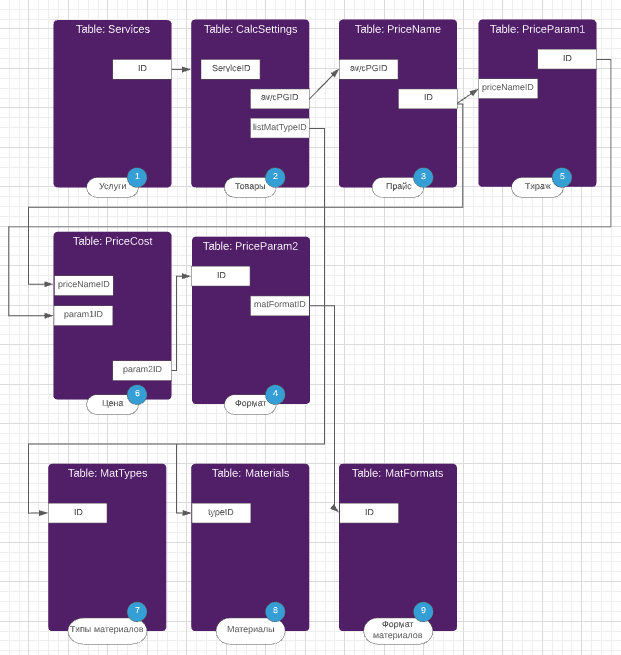

### Разработка калькулятора:

Стек: Typescript, PHP, SQL

> Задача под БД клиента (SQL Server Express): backend - сделать API, frontend - сделать виджет с калькулятором.  
Задача усложняется неверно спроектированной БД.  
На картинке ниже изобразил связи между таблицами (цифры в синих кружках - порядок вывода блока в калькуляторе):

### Demo: http://slim.xppx.ru/work-frontend/
